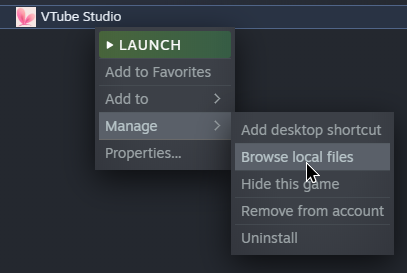

# VTS Strimertul plugin

Strimertul integration for VTube Studio.

## Building

Create a new file called `StulPlugin.csproj.user` with the following content:

```xml
<Project>
  <PropertyGroup>
    <VTubeStudioPath>C:\path\to\vtubestudio</VTubeStudioPath>
  </PropertyGroup>
</Project>
```

You can find the path to fill in by right-clicking VTube Studio and selecting "Browse local files":


Once this is done, just build the project with your IDE of choice, or run `dotnet build` from the command line.

## License

The project is licensed under the ISC license. Check `LICENSE` for more information.

This project uses NativeWebSocket, check `WebSocket.cs` for license details.